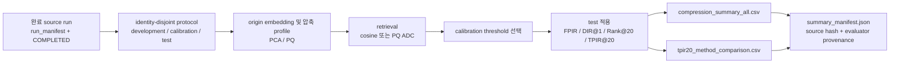

# Step8 압축 얼굴 임베딩 1:N Open-set 평가 기술 감사 및 논문 주장 경계

- 작성일: 2026-08-14 (Asia/Seoul)
- 분석 대상 저장소·브랜치: `C:/ronbun`, `step8`
- 분석 대상 HEAD: `bc2b4076d7cc60e4afc98a4564b6eb4f07cc8fa0`
- 비교 기준: Step7 기준점 `e417c28`, Step8 TPIR 도입 커밋 `27da1a0`, 현재 결과 커밋 `bc2b407`
- 분석 대상: ArcFace, AdaFace, MagFace, EdgeFace × LFW, SurvFace, RFW-Custom의 명시된 12개 완료 run과 `search_space_v5_tpir20_multi_fpir`
- 이전 novelty 기준: `novelty/1.md`–`novelty/5.md`
- architecture 기준: `architect/20260813.md`, `architect/20260814.md`
- 감사 성격: 코드·manifest·CSV·테스트를 교차 확인한 정적/재현성 감사. 새 실험을 실행하거나 기존 artifact를 변경하지 않았다.

## 판정 범례

| 판정 | 의미 |
|---|---|
| **확인됨(Confirmed)** | 현재 코드, 완료 run, manifest, CSV 또는 재실행 테스트가 직접 뒷받침한다. |
| **지지되나 재검증 필요(Supported, validation required)** | 탐색적 수치나 일부 모델·데이터셋에서 지지되지만 clean evaluator 재생성, 독립 반복 또는 추가 대조가 필요하다. |
| **방어 불가(Not defensible)** | 현재 자료로 인과·일반화·시스템 성능·novelty를 주장할 수 없다. |

## 0. Executive Summary

### 0.1 최종 판정

1. **Step8의 TPIR@20 계산 논리는 확인됨이다.** TPIR@20은 mated probe에서 정답 identity의 rank가 20 이내이고, **정답 identity 자신의 점수**가 임계값을 넘을 때만 성공으로 센다. Top-1 점수를 잘못 재사용하지 않는다. 해당 반례 단위 테스트도 존재한다.
2. **FPIR·DIR·Rank@20·TPIR@20의 분모와 calibration/test 분리는 확인됨이다.** LFW는 calibration DIR 최대화 제약식, SurvFace/RFW-Custom은 non-mated calibration score만을 사용한 threshold 선택을 적용하며 test score를 threshold 선택에 사용하지 않는다.
3. **현재 12개 v5 수치는 논문 최종 결과로 사용할 수 없다.** 모든 `summary_manifest.json`이 `claim_status=exploratory_dirty_evaluator`, `derived_evaluation_paper_eligible=false`, `evaluator_git.dirty=true`이다. 11개는 dirty `1507ad61...`, ArcFace-LFW 하나는 dirty `27da1a0...`에서 생성됐고, 현재 기준 HEAD `bc2b407`에서 생성된 것이 없다. 따라서 아래 수치는 방향 확인용 탐색 결과이며, 같은 완료 source run을 clean checkout에서 재생성해야 한다.
4. **Saliency–압축 민감도 상관은 SurvFace에서만 일관되게 관찰되고 LFW/RFW-Custom에서는 거의 0이다.** PQ-m128 angular error와 face-region mass의 Spearman rho는 SurvFace에서 Arc/Ada/Mag/Edge 각각 약 `0.238/0.191/0.279/0.242`이지만, LFW와 RFW-Custom에서는 대부분 신뢰구간이 0을 포함한다. 세부 영역의 부호는 모델마다 바뀌므로 “눈은 안정적이고 입·턱은 취약하다” 같은 보편 주장은 방어할 수 없다.
5. **압축 효과는 표현·검색 방식·gallery 규모·운영점에 따라 달라진다.** PQ-m128은 raw vector payload 기준 16배 축소지만 codebook을 포함하면 SurvFace 약 6.76배, RFW-Custom 약 3.63배이고 LFW처럼 gallery가 50개뿐이면 오히려 총량이 증가한다. SurvFace 10% FPIR 부근에서 PQ-m128 ADC는 TPIR@20을 대체로 보존하지만, PCA direct cosine은 재보정 후에도 목표 FPIR을 넘는 경우가 많다.

요청된 세 우선 질문을 한 줄로 압축하면 다음과 같다.

| 우선 질문 | 감사 결론 |
|---|---|
| ① 기존 evaluator/threshold/TPIR20/calibration 문제는 수정됐는가 | **핵심 산술과 split 계약은 수정 확인됨.** 다만 dirty derived provenance, point-estimate target gate, notebook output은 미해결이다. |
| ② 4모델×3데이터셋 Saliency–Spearman rho는 무엇을 보이는가 | **SurvFace의 face mass에서만 공통의 약한 양의 rho가 안정적이다.** 세부 부위·entropy의 부호는 모델별로 달라 보편 패턴과 인과 주장은 불가하다. |
| ③ PCA/PQ 압축 성능은 어떤가 | **calibration은 score shift를 회복할 수 있지만 Rank@20 손실은 회복하지 못한다.** 저장 이득과 성능은 profile·score space·gallery scale·실현 FPIR을 함께 봐야 한다. |

### 0.2 논문 사용 가능성

| 항목 | 판정 | 논문 사용 방식 |
|---|---|---|
| evaluator 정의와 단위 테스트 | **확인됨** | 방법론·구현 설명에 사용 가능 |
| 12개 source run 완료 상태와 identity-disjoint split | **확인됨** | protocol/provenance 설명에 사용 가능 |
| 현재 v5 TPIR20 수치 | **지지되나 재검증 필요** | 탐색 결과로만 사용; 최종 표·초록·결론 인용 금지 |
| saliency 상관 | **지지되나 재검증 필요** | association으로만 기술; 인과·예측 이득 주장 금지 |
| PostgreSQL/pgvector latency·처리량 개선 | **방어 불가** | 현재 v5는 in-memory search 중심이라 시스템 성능 주장 금지 |
| 모델 architecture/loss의 인과적 우열 | **방어 불가** | source commit과 checkpoint가 달라 same-protocol 관찰 비교로 제한 |

## 1. 코드·데이터·artifact 흐름



| 책임 | 주요 코드·artifact | 감사 결과 |
|---|---|---|
| dataset/config | `configs/experiments/lfw_face_search.yaml`, `survface_face_search.yaml`, `rfw_balancedface_quantization.yaml`; `research/datasets/*` | source, split, path, protocol 입력을 config/manifest로 고정 |
| 모델·embedding | `research/embeddings/pytorch/official_backbones.py::build_arcface_backbone/build_adaface_backbone/build_magface_backbone/build_edgeface_backbone` | checkpoint별 512D embedding 생성; source run에 model UID/hash 기록 |
| 공통 orchestration | `research/experiments/pipeline_runner.py::build_common_experiment_plan/run_common_step4_experiment` | 모델·데이터셋·단계·재사용 selector와 실행 계약 구성 |
| gallery/probe | `research/protocols/open_set.py`; `research/datasets/rfw_custom.py::build_rfw_custom_open_set_bundle` | identity-disjoint split과 gallery/registered/unknown role 구성 |
| PCA/PQ | `research/compression/profiles.py::fit_pca_family/fit_pq_auxiliary_profile` | origin, PCA, PQ code/reconstruction과 error/storage artifact 생성 |
| 정답 rank/score | `research/evaluation/compression_characterization.py::_true_identity_rank_and_score` | retained Top-k 안의 정답 identity와 그 점수를 함께 반환 |
| origin/compressed retrieval | `compare_cosine_retrieval` | rank, score, accepted, DIR, TPIR을 query 단위로 생성 |
| threshold 재적용 | `apply_retrieval_thresholds` | search를 다시 하지 않고 정답 score로 TPIR 재계산 |
| 요약·CI | `research/experiments/step2_compression.py::_summarize` | mated/non-mated 분모, Wilson CI, paired bootstrap delta, Rank@20/TPIR@20 기록 |
| threshold | `research/calibration/rejection.py` | LFW constrained DIR 선택; SurvFace/RFW-Custom non-mated-only quantile/tie 정책 |
| protocol | `research/protocols/open_set.py` | split identity disjoint와 role 제약을 생성·검증 |
| saliency feature·상관 | `research/explainability/gradcam/features.py::summarize_saliency_features`; `research/evaluation/cross_dataset_saliency.py::load_cross_dataset_saliency_associations` | 영역별 mass/entropy를 compression sensitivity와 join하고 rho/CI 계약 검증 |
| 논문 report | `notebooks/common/reports/00_cross_dataset_results.ipynb` | 4모델×3데이터셋 compact table 생성; 현재 output-free test 위반 |
| v5 집계 | `results/paper/<dataset>/<run>/search_space_v5_tpir20_multi_fpir/` | compact summary는 존재하나 dirty evaluator provenance |

12개 source run은 모두 `run_manifest.json["status"] == "completed"`, `COMPLETED` marker 존재, source git dirty false, `source_run_full_paper_eligible=true`였다. 다만 source commit은 ArcFace `ca8496a7`, AdaFace `33c80d9`, MagFace `f4f997c`, EdgeFace `5f3cb90`으로 서로 다르다.

### 1.1 명시적 run과 수치 추적 경로

| 모델 | LFW run | SurvFace run | RFW-Custom run |
|---|---|---|---|
| ArcFace | `20260810-R001-e9b2f0fd` | `20260810-R001-5d742943` | `20260810-R001-558cd106` |
| AdaFace | `20260811-R001-c2e11ab2` | `20260811-R001-cb329ad5` | `20260811-R001-84619ab9` |
| MagFace | `20260811-R001-f9c81fe5` | `20260811-R001-dcc2dbde` | `20260811-R001-7549107b` |
| EdgeFace | `20260812-R001-1f1ae4fc` | `20260812-R001-ea495479` | `20260812-R001-22dd0f7b` |

각 수치는 다음 실제 파일 계약으로 역추적했다.

| 목적 | 경로 규칙 | 확인한 핵심 column |
|---|---|---|
| 압축 오차·검색·CI·저장 | `results/paper/common/<model>/<dataset>-<run>/compression_summary_all.csv` | `compression_profile`, `search_mode`, `mean_angular_error_rad`, `compressed_realized_fpir`, `compressed_dir_rank1`, `compressed_tpir20`, `compressed_tpir20_retention`, `compressed_closed_set_rank20_recall`, `agreement_with_origin_rate`, `storage_bytes_per_embedding`, `codebook_bytes` |
| TPIR 방법 비교 | 같은 디렉터리의 `tpir20_method_comparison.csv` | `comparison_role`, `threshold_policy`, `target_fpir`, `realized_fpir`, `tpir20`, `tpir20_retention`, `closed_set_rank20_recall`, `target_met_on_test` |
| 논문 compact 표 | 같은 디렉터리의 `dir_fpir_storage_latency.csv`와 `survface_tpir20_comparison.csv` | FPIR/DIR/TPIR count·CI, amortized storage, latency fields |
| saliency association | 같은 디렉터리의 `saliency_geometry_associations_all.csv` | `saliency_feature`, `sensitivity_metric`, `sample_count`, `identity_count`, `spearman_rho`, `bootstrap_ci_low/high` |
| eligibility·lineage | `results/paper/<dataset>/<run>/search_space_v5_tpir20_multi_fpir/summary_manifest.json` | `claim_status`, `derived_evaluation_paper_eligible`, evaluator git commit/dirty, source hashes |
| source summary | 각 완료 run의 `step4_summary.json`, run/phase manifest 및 config | model/protocol UID, saliency coverage, source artifact hashes |

예를 들어 ArcFace-SurvFace 수치는 `results/paper/common/arcface/survface-20260810-R001-5d742943/`의 위 CSV들을 조인해 확인했다. 다른 11개 cell도 모델명과 명시적 run만 바꾼 동일 경로 계약을 사용했다.

## 2. Evaluator 기술 감사

### 2.1 지표 정의

mated probe 집합을 \(M\), non-mated probe 집합을 \(U\), 임계값을 \(\tau\), Top-1 identity와 score를 \((\hat y_i,s_{i,1})\), 정답 identity의 rank와 score를 \((r_i^+,s_i^+)\)로 둔다.

\[
\mathrm{FPIR}(\tau)=\frac{1}{|U|}\sum_{i\in U}\mathbf 1[s_{i,1}\ge\tau]
\]

\[
\mathrm{DIR@1}(\tau)=\frac{1}{|M|}\sum_{i\in M}
\mathbf 1[\hat y_i=y_i\land s_{i,1}\ge\tau]
\]

\[
\mathrm{Rank@20}=\frac{1}{|M|}\sum_{i\in M}\mathbf 1[r_i^+\le20]
\]

\[
\mathrm{TPIR@20}(\tau)=\frac{1}{|M|}\sum_{i\in M}
\mathbf 1[r_i^+\le20\land s_i^+\ge\tau]
\]

따라서 `TPIR@20 ≥ DIR@1`이고 `TPIR@20 ≤ Rank@20`이어야 한다. 확인한 summary에서 이 순서 관계는 유지됐다.

### 2.2 이전 문제와 Step8 수정 판정

| 이전 위험 | Step8 상태 | 근거·잔여 한계 |
|---|---|---|
| TPIR@20이 Top-1 score를 사용해 과대계상될 위험 | **수정 확인됨** | 정답이 rank 2이고 Top-1만 threshold를 넘는 반례에서 TPIR=false인 테스트 통과 |
| TPIR 분모에 non-mated 또는 누락 query가 섞일 위험 | **수정 확인됨** | mated count를 독립 분모로 사용하고 정답 rank 미존재는 실패 처리 |
| 10% 한 운영점만 보고할 위험 | **수정 확인됨** | `0.01, 0.05, 0.10, 0.20, 0.30`을 정확한 target set으로 강제 |
| frozen origin threshold를 PQ ADC에 적용할 위험 | **수정 확인됨** | ADC score space는 `negative_squared_l2_adc`; `frozen_origin_threshold_applicable=false`, compressed recalibration만 허용 |
| test data로 threshold를 선택할 위험 | **누출 정황 없음** | threshold source=`calibration`, evaluation=`test`, `test_used_for_threshold_selection=false` |
| `target_met_on_test`를 통계적 보장으로 오해 | **잔여 Major** | 값은 단순히 `realized_fpir <= target_fpir`; Wilson upper bound 제약이 아님 |
| query-level 재감사 가능성 | **잔여 Major** | v5는 `compact_only=true`이며 row-level derived ledger를 보존하지 않음 |

### 2.3 split 및 leakage 감사

| 데이터셋 | 전체 rows / identities | development | calibration | test | split 간 identity overlap |
|---|---:|---:|---:|---:|---:|
| LFW | 13,195 / 5,736 | 7,742 / 3,444 | 3,039 / 1,146 | 2,414 / 1,146 | 모두 0 |
| SurvFace | 463,341 / 130,055 | 176,205 / 4,255 | 44,683 / 1,064 | 242,453 / 124,736 | 모두 0 |
| RFW-Custom | 40,520 / 11,403 | 16,202 / 4,559 | 8,055 / 2,278 | 16,263 / 4,566 | 모두 0 |

SurvFace test는 gallery 60,294 images/3,000 identities, registered probe 60,423/3,000, unknown probe 121,736/121,736이다. RFW-Custom test는 gallery 1,200/1,200, registered probe 3,104/1,200, known-unknown 5,981/1,683, unknown-unknown 5,978/1,683이다. 코드와 선택 manifest에서 identity overlap이나 gallery/probe image 중복 누출 정황은 발견되지 않았다.

단, RFW-Custom은 **비공식 1:N 파생 protocol**이며 `official_result_eligible=false`, train/test identity overlap 상태도 공식 RFW 1:1과 같은 의미로 해석할 수 없다. RFW-Official 1:1 결과와 표·namespace·주장을 합치면 안 된다.

### 2.4 테스트 재실행

관련 9개 테스트 모듈을 실행한 결과 `79 passed, 2 failed`였다.

```powershell
py -X utf8 -m pytest -q tests/research/test_compression_characterization.py tests/research/test_metrics.py tests/research/test_step2_compression.py tests/research/test_refresh_step4_search_spaces.py tests/research/test_cross_model_matrix.py tests/research/test_pipeline_runner.py tests/research/test_notebook_layout.py tests/research/test_cross_dataset_saliency.py tests/research/test_faithfulness_artifacts.py
```

- 통과: evaluator, compression, v5 refresh, cross-model matrix, pipeline, cross-dataset saliency, faithfulness artifact 관련 핵심 테스트.
- 실패 1: `cross_dataset_calibration_transfer.ipynb`에 execution count가 남아 restartable/output-free 계약 위반.
- 실패 2: `00_cross_dataset_results.ipynb`에 10개 실행 code cell과 10개 output이 남아 동일 계약 위반.

이는 지표 산술 오류는 아니지만, committed notebook이 thin/restartable이어야 한다는 재현성 계약 위반이므로 최종 제출 전에 수정해야 한다.

## 3. 기존 문제점 수정 여부 및 심각도

| 문제 | 이전/위험 상태 | 현재 상태 | 심각도 | 추가 수정 필요 여부 |
|---|---|---|---|---|
| TPIR20 genuine score | Top-1 accepted를 정답 TPIR로 오인할 위험 | 정답 rank·정답 score를 사용하고 반례 테스트 통과 | 문제 없음 | clean artifact 재생성만 필요 |
| 다중 FPIR·score space | 단일 10% 중심, ADC에 cosine threshold 전이 위험 | 1/5/10/20/30% 강제, ADC 별도 recalibration | 문제 없음 | 운영점별 CI gate 보강 권장 |
| calibration/test 분리 | threshold leakage 위험 | manifest와 코드상 calibration 선택 후 test 고정 적용 | 문제 없음 | query ledger로 재감사성 보강 |
| v5 evaluator provenance | 수정 중 dirty tree에서 결과 생성 | 12개 모두 `exploratory_dirty_evaluator` | **Major** | clean `bc2b407`에서 12개 재집계 필수 |
| `target_met_on_test` | 목표 만족을 통계 보장처럼 읽을 위험 | point estimate만 비교 | **Major** | Wilson UCB/one-sided bound gate 추가 |
| compact-only 파생 결과 | 개별 TPIR 판정의 사후 감사 필요 | row-level derived ledger 미보존 | **Major** | hash-pinned audit ledger 보존 |
| notebook 재현성 | committed notebook은 output-free여야 함 | 2개 notebook 때문에 2 tests failed | **Major** | output/count 제거 및 81 tests 재통과 |
| DB 시스템 주장 | in-memory latency를 pgvector 성능으로 오해할 위험 | 실제 end-to-end DB 측정 없음 | **Major** | pgvector exact/HNSW·hot/cold 실험 필요 |
| 모델 간 인과 비교 | 서로 다른 source commit/checkpoint | same-protocol 관찰 비교만 가능 | **Minor** | same-commit rerun 또는 주장 제한 |
| CI 범위 | probe 독립성을 가정 | Wilson 및 probe-level paired bootstrap만 존재 | **Minor** | identity-cluster·반복 run 불확실성 추가 |
| RFW saliency 표본 | 모델별 coverage 차이 | Arc/Ada 2,048, Mag/Edge 10,000 | **Minor** | 동일 cap과 coverage provenance 권장 |

현재 발견된 **Critical 산술 오류나 split leakage는 없다.** 가장 큰 차단 요인은 evaluator 구현이 아니라 파생 결과의 dirty provenance와 논문 재현성 계약이다.

## 4. 압축 성능 감사

실제 summary의 profile inventory는 Origin-512, PCA `32/64/128/256/384`, PQ `m8/m16/m32/m64/m128`(각 8-bit subquantizer)다. PCA는 `pca_direct_cosine`과 `pca_reconstruction_cosine`, PQ는 `pq_adc_exhaustive`와 `pq_reconstruction_cosine`을 분리했다. 모든 profile·다섯 operating point를 artifact에서 확인했으며, 본문 표는 결론을 가장 잘 드러내는 Origin, PCA-128, PCA-256, PQ-m32, PQ-m128을 우선 제시한다. 전체 행은 위 `compression_summary_all.csv`와 `tpir20_method_comparison.csv`가 원본이다.

### 4.1 10% FPIR 목표의 origin 비교

아래는 현재 v5의 **탐색 수치**다. 괄호 안 순서는 `실현 FPIR / TPIR@20 / Rank@20 / DIR@1`, 단위는 %다.

| 모델 | LFW | SurvFace | RFW-Custom |
|---|---|---|---|
| ArcFace | 0.059 / 97.269 / 98.739 / 97.269 | 9.269 / 1.274 / 16.848 / 0.652 | 9.257 / 99.807 / 100 / 99.807 |
| AdaFace | 0.059 / 97.059 / 98.529 / 97.059 | 9.308 / 1.334 / 17.778 / 0.665 | 9.934 / 99.646 / 100 / 99.646 |
| MagFace | 0.059 / 97.269 / 98.950 / 97.269 | 9.361 / 1.173 / 15.105 / 0.493 | 8.847 / 98.615 / 99.968 / 98.486 |
| EdgeFace | 8.412 / 97.269 / 99.370 / 97.269 | **10.012 / 0.670 / 18.283 / 0.278** | **10.151 / 93.009 / 99.678 / 92.622** |

EdgeFace-SurvFace와 EdgeFace-RFW-Custom은 point estimate조차 10% 목표를 넘는다. 따라서 모델 간 TPIR을 같은 “10% FPIR 운영점”으로 직접 순위화하면 안 된다.

### 4.2 SurvFace PQ-m128 ADC: 다중 FPIR

| 모델 | Target FPIR | Origin: FPIR / TPIR20 | PQ-m128 ADC: FPIR / TPIR20 | TPIR retention | 비교 가능성 |
|---|---:|---:|---:|---:|---|
| Arc | 1% | 1.241 / 0.098 | 1.250 / 0.078 | 0.797 | 둘 다 목표 실패 |
| Arc | 5% | 4.990 / 0.662 | 4.978 / 0.606 | 0.915 | point-met |
| Arc | 10% | 9.269 / 1.274 | 9.313 / 1.177 | 0.923 | point-met |
| Arc | 20% | 18.001 / 2.478 | 18.175 / 2.373 | 0.958 | point-met |
| Arc | 30% | 27.075 / 3.712 | 27.308 / 3.613 | 0.973 | point-met |
| Ada | 1% | 0.839 / 0.207 | 0.837 / 0.200 | 0.968 | point-met |
| Ada | 5% | 4.543 / 0.730 | 4.571 / 0.688 | 0.943 | point-met |
| Ada | 10% | 9.308 / 1.334 | 9.228 / 1.279 | 0.959 | point-met |
| Ada | 20% | 18.421 / 2.501 | 18.469 / 2.387 | 0.954 | point-met |
| Ada | 30% | 27.855 / 3.760 | 27.805 / 3.641 | 0.968 | point-met |
| Mag | 1% | 0.971 / 0.101 | 0.943 / 0.091 | 0.902 | point-met |
| Mag | 5% | 4.700 / 0.594 | 4.598 / 0.576 | 0.969 | point-met |
| Mag | 10% | 9.361 / 1.173 | 9.243 / 1.135 | 0.968 | point-met |
| Mag | 20% | 18.723 / 2.236 | 18.841 / 2.196 | 0.982 | point-met |
| Mag | 30% | 28.467 / 3.406 | 28.388 / 3.308 | 0.971 | point-met |
| Edge | 1% | 1.248 / 0.003 | 1.188 / 0.003 | 1.000 | 둘 다 목표 실패 |
| Edge | 5% | 5.184 / 0.159 | 5.138 / 0.144 | 0.906 | 둘 다 목표 실패 |
| Edge | 10% | 10.012 / 0.670 | 10.000 / 0.669 | 0.998 | origin 실패; PQ point-met 경계 |
| Edge | 20% | 19.730 / 1.953 | 19.769 / 1.877 | 0.961 | point-met |
| Edge | 30% | 29.195 / 3.259 | 29.227 / 3.136 | 0.962 | point-met |

PQ-m128 ADC는 SurvFace에서 Rank@20을 Arc `16.848→16.065`, Ada `17.778→16.861`, Mag `15.105→14.534`, Edge `18.283→17.331`로 낮춘다. 재보정으로 threshold crossing의 상당 부분은 회복되지만, 이 Rank@20 감소는 threshold만으로 복구할 수 없는 검색 순위 손실이다.

### 4.3 SurvFace PCA 10% FPIR

| 모델 | PCA-128 direct: FPIR / TPIR20 / retention / Rank20 | PCA-128 reconstruction: FPIR / TPIR20 / retention / Rank20 |
|---|---|---|
| Arc | **10.967 / 1.395 / 1.095 / 11.310** | 9.476 / 1.132 / 0.888 / 15.924 |
| Ada | **10.984 / 1.248 / 0.935 / 11.135** | 9.539 / 1.226 / 0.919 / 16.737 |
| Mag | **10.182 / 1.516 / 1.292 / 10.595** | 9.371 / 1.077 / 0.918 / 14.483 |
| Edge | **10.279 / 0.988 / 1.474 / 13.938** | **10.012 / 0.670 / 1.000 / 18.283** |

굵은 값은 target point estimate를 넘는다. PCA direct의 TPIR retention이 1보다 큰 사례는 “압축이 정확도를 개선했다”는 뜻이 아니다. 더 높은 실현 FPIR, 변한 score space, 낮아진 Rank@20 ceiling이 섞여 있으므로 동일 제약 아래 비교가 아니다. Reconstruction cosine은 원본 공간에 더 가까운 순위를 보존하지만, EdgeFace origin 자체가 target을 넘으므로 동일 운영점 주장에는 여전히 부적합하다.

### 4.4 SurvFace agreement와 angular error

다음 값은 target FPIR 10%, compressed-recalibrated row에서 읽었다. Agreement는 최종 retrieval/decision record가 origin과 일치한 비율이고, angular error는 profile 자체의 origin embedding 대비 평균 각도 오차다.

| 모델 | PCA-128 direct: agreement / angular(rad) | PCA-128 reconstruction: agreement / angular(rad) | PQ-m128 ADC: agreement / angular(rad) |
|---|---:|---:|---:|
| ArcFace | 0.364 / 0.316 | 0.804 / 0.316 | 0.710 / 0.265 |
| AdaFace | 0.360 / 0.335 | 0.797 / 0.335 | 0.710 / 0.272 |
| MagFace | 0.406 / 0.248 | 0.856 / 0.248 | 0.723 / 0.256 |
| EdgeFace | 0.555 / 0.000026 | 0.999995 / 0.000026 | 0.770 / 0.261 |

동일 PCA representation이라도 direct와 reconstruction의 angular error 열은 같지만 agreement가 크게 다르다. 즉 reconstruction error만으로 retrieval preservation을 대체할 수 없고, 실제 search geometry와 rank/agreement를 별도로 측정해야 한다.

### 4.5 저장량

| profile | raw payload/vector | codec parameters | LFW 총량 환산 | SurvFace 총량 환산 | RFW-Custom 총량 환산 |
|---|---:|---:|---:|---:|---:|
| Origin-512 | 2,048 B | 0 | 2,048 B/template | 2,048 B/template | 2,048 B/template |
| PCA-128 | 512 B | 264,192 B | 5,795.84 B (0.353×) | 600.064 B (3.413×) | 732.16 B (2.797×) |
| PCA-256 | 1,024 B | 526,336 B | 11,550.72 B (0.177×) | 1,199.445 B (1.707×) | 1,462.613 B (1.400×) |
| PQ-m32 | 32 B | 524,288 B | 10,517.76 B (0.195×) | 206.763 B (9.905×) | 468.907 B (4.368×) |
| PQ-m128 | 128 B | 524,288 B | 10,613.76 B (0.193×) | 302.763 B (6.764×) | 564.907 B (3.625×) |

괄호는 origin 대비 총량 축소비다. PQ-m128의 raw code만 보면 16배지만 codebook amortization을 포함한 실제 gallery 축소비는 규모 의존적이다. LFW의 50-template gallery에서 압축 총량이 origin보다 커지는 결과는 작은 gallery에 대한 중요한 반례다.

### 4.6 EdgeFace의 PCA 특수성

EdgeFace의 PCA-128/256/384 reconstruction MSE는 약 `1e-12`, 평균 angular error는 약 `2.5e-05 rad`로 사실상 lossless다. `official_backbones.py`의 LoRA head는 `linear1.weight=(115,192)`, `linear2.weight=(512,115)`인 저랭크 경로를 사용하므로 512D 출력이 최대 약 115차원의 affine subspace에 놓일 수 있다.

따라서 다음 두 주장을 구분해야 한다.

- **확인됨:** 이 checkpoint에서 PCA-128 reconstruction이 거의 원본을 복원한다.
- **방어 불가:** 일반적인 EdgeFace 또는 모든 얼굴 임베딩에서 PCA-128이 무손실이다.

PCA direct coordinate에서 cosine을 계산하면 원본/reconstruction cosine과 metric이 달라져 SurvFace ranking agreement가 약 0.555까지 낮아질 수 있다. 이는 “정보 차원”과 “검색 score geometry”를 별개로 봐야 한다는 코드-수치 교차검증 결과다.

## 5. SurvFace TPIR20 집중 분석

4.2와 4.3의 다중-FPIR 표가 요청한 우선 비교표다. 특히 10%에서는 Origin 대비 PQ-m128 ADC TPIR retention이 Arc/Ada/Mag/Edge 각각 `0.923/0.959/0.968/0.998`이지만, Edge의 origin FPIR은 `10.012%`로 목표를 넘고 PQ는 반올림 경계인 `10.000%`다. 따라서 Edge를 “완전 보존” 사례로 단정하지 않고 경계 사례로 둔다.

### 5.1 SurvFace 오류 분해

| 오류 | calibration으로 회복 가능성 | 진단 지표 |
|---|---|---|
| score scale/offset 변화 | 높음 | frozen 대비 recalibrated FPIR·TPIR 변화 |
| threshold crossing | 높음 | 동일 ranking에서 accept/reject 변화 |
| true identity rank 하락 | 없음 | Rank@20 감소, candidate recall 감소 |
| 정답 identity가 retained Top-k 밖으로 이탈 | 없음 | TPIR ceiling을 Rank@20이 제한 |
| ANN candidate miss | threshold로 불가 | exact 대비 ANN candidate recall |

SurvFace PCA-128 direct의 frozen threshold는 Arc/Ada/Mag에서 FPIR이 `0.687/0.193/0.351%`로 지나치게 보수적이고 TPIR@20도 `0.041/0.053/0.060%`에 불과하다. 재보정 후 TPIR은 `1.395/1.248/1.516%`로 회복되지만 FPIR은 모두 10%를 넘고 Rank@20은 origin보다 크게 낮다. 즉 score-scale 오류는 회복했으나 ranking 손실은 남는다.

PCA-128 reconstruction은 Arc/Ada/Mag에서 frozen FPIR이 `17.378/17.361/14.909%`로 과대 수락하지만 재보정 후 `9.476/9.539/9.371%`로 돌아온다. 이 경우 재보정이 주로 threshold shift를 회복한다. PQ ADC는 cosine과 전혀 다른 score space이므로 frozen origin threshold 비교 자체가 정의되지 않는다.

### 5.2 압축이 TPIR을 높인 반례의 해석

탐색 결과 중 MagFace-SurvFace PCA direct는 5% 목표에서 origin과 compressed가 모두 point-met하면서 TPIR@20이 증가하는 사례가 있다. 예를 들어 PCA-128은 `0.594%→0.930%`, paired delta 95% CI가 약 `[+0.275,+0.397]` percentage point다. 동시에 Rank@20은 `15.105%→10.595%`로 감소한다.

이는 다음을 의미한다.

- 압축이 항상 TPIR을 떨어뜨린다는 보편 명제는 거짓이다.
- threshold와 score distribution 변화가 일부 mated probe의 수락을 늘릴 수 있다.
- 그러나 검색 가능한 정답의 ceiling은 낮아졌으므로 representation 자체가 더 우수하다는 인과 주장은 방어할 수 없다.
- dirty evaluator 결과이므로 clean 재생성과 multiplicity/selection 영향을 확인해야 한다.

## 6. Saliency–Spearman rho 감사

### 6.1 표본과 통계 계약

- geometry association은 각 model×dataset cell에서 19 saliency features × 3 sensitivity metrics × 10 compression profiles, 총 570행을 보고한다.
- Spearman rho와 identity-cluster bootstrap 95% CI를 사용한다.
- saliency 선택 수는 LFW 9,133, SurvFace 182,159로 모델 간 동일하다.
- RFW-Custom은 Arc/Ada 2,048, Mag/Edge 10,000으로 달라 cross-model 정밀도 비교에 주의해야 한다.

### 6.2 PQ-m128 angular error와 주요 saliency feature

| 모델 | LFW face rho [95% CI] | SurvFace face rho [95% CI] | RFW-Custom face rho [95% CI] | SurvFace의 주요 세부 패턴 |
|---|---|---|---|---|
| ArcFace | +0.048 [-0.007, +0.100] | **+0.238 [+0.229, +0.248]** | -0.002 [-0.044, +0.044] | eyes 음, nose +0.073, mouth +0.173, jaw +0.158, entropy -0.133 |
| AdaFace | -0.008 [-0.077, +0.053] | **+0.191 [+0.182, +0.201]** | -0.028 [-0.067, +0.014] | eyes 음, nose +0.061, mouth +0.187, jaw +0.155, entropy -0.272 |
| MagFace | +0.014 [-0.031, +0.063] | **+0.279 [+0.270, +0.289]** | -0.005 [-0.025, +0.014] | eyes·nose·mouth·jaw 양, entropy +0.249 |
| EdgeFace | -0.043 [-0.093, +0.004] | **+0.242 [+0.234, +0.250]** | 약 0 | nose +0.211, mouth -0.002, jaw -0.047, entropy -0.069 |

`outside_face_mass`는 SurvFace에서 face mass와 거의 대칭인 음의 rho를 보인다. 그러나 세부 영역은 모델별 부호가 다르고 entropy도 AdaFace `-0.272`와 MagFace `+0.249`로 반대다.

PCA-128 angular error도 SurvFace에서 Arc/Ada/Mag의 face rho가 약 `0.254/0.202/0.273`이지만 EdgeFace는 거의 0이다. 이는 EdgeFace PCA-128이 사실상 lossless라는 구조적 결과와 일치한다.

### 6.3 해석 경계

**확인됨**

- SurvFace에서 face/outside saliency mass와 압축 angular error 사이에 작지만 안정적인 단조 association이 있다.
- 이 association은 데이터셋과 모델·압축 profile에 따라 달라진다.

**지지되나 재검증 필요**

- surveillance domain의 pose, blur, occlusion, background 또는 alignment 조건이 saliency 분포와 압축 민감도를 함께 변화시킬 가능성.
- saliency가 특정 compression profile의 취약 표본을 층화하는 보조 특징일 가능성.

**방어 불가**

- saliency가 압축 오류의 원인이라는 인과 주장.
- 특정 얼굴 부위가 네 모델에서 보편적으로 취약하다는 주장.
- saliency가 reconstruction error, norm, margin, image quality 같은 cheap baseline보다 추가 예측력을 제공한다는 주장. 현재 incremental model/ablation artifact가 없다.

### 6.4 Saliency faithfulness와 인과 주장

faithfulness artifact는 4모델×3데이터셋의 동일 계약으로 완성되지 않았다. Arc/Ada는 주로 SurvFace v1 2,048 표본이고, Mag/Edge는 v2 9,133–10,000 표본이다. 모든 faithfulness manifest는 `paper_eligible=false`이거나 `validation_required`다.

대표적인 high-saliency occlusion drop / low-saliency drop / random drop은 다음과 같다.

| 모델·데이터셋 | High | Low | Random | High-Low | High-Random |
|---|---:|---:|---:|---:|---:|
| Arc-SurvFace | 0.0903 | 0.0313 | 0.1145 | +0.0590 | -0.0242 |
| Ada-SurvFace | 0.1058 | 0.0215 | 0.1814 | +0.0844 | -0.0756 |
| Mag-LFW | 0.0719 | 0.2070 | 0.3256 | -0.1351 | -0.2537 |
| Mag-SurvFace | 0.0965 | 0.1887 | 0.2149 | -0.0922 | -0.1184 |
| Mag-RFW | 0.0822 | 0.1715 | 0.2576 | -0.0893 | -0.1754 |
| Edge-LFW | 0.0540 | 0.0822 | 0.0666 | -0.0282 | -0.0126 |
| Edge-SurvFace | 0.0809 | 0.1341 | 0.0882 | -0.0532 | -0.0073 |
| Edge-RFW | 0.0526 | 0.0842 | 0.0756 | -0.0316 | -0.0230 |

강한 faithfulness 기준, 즉 high-minus-low와 high-minus-random의 CI 하한이 모두 0보다 큰 조건을 만족했다고 볼 수 없다. 따라서 saliency map의 시각적 타당성이나 rho만으로 압축 민감도의 원인·설명력을 주장하면 안 된다.

## 7. Recoverable shift와 irreversible ranking loss

Section 5의 SurvFace 수치를 연구 질문에 맞춰 다시 분해하면 다음과 같다.

| 관찰 | recoverable score shift | irreversible ranking loss |
|---|---|---|
| frozen threshold에서 FPIR이 목표에서 크게 이탈 | recalibration으로 상당 부분 복구 가능 | 해당 없음 |
| recalibration 후 FPIR은 맞지만 TPIR/DIR이 낮음 | 일부 accept/reject 경계는 복구 | Rank@20이 낮으면 그 ceiling 이상으로 복구 불가 |
| PCA direct와 reconstruction의 차이 | score geometry별 threshold 필요 | direct projection cosine이 정답 순서를 바꿀 수 있음 |
| PQ ADC | ADC 전용 threshold로 보정 | quantized lookup이 만든 순위 변화는 남음 |

현재 결과는 사용자가 제시한 핵심 명제를 **부분적으로 강하게 지지**한다. 즉 compression-specific calibration이 score-distribution shift를 고치지만 rank destruction은 고치지 못한다는 구분은 코드와 결과 모두에 나타난다. 다만 “각 FR model과 input condition의 safe compression ceiling”은 아직 자동 선택 규칙이나 UCB 기반 보장으로 구현되지 않았다. 현재는 profile×dataset×model별 경험적 frontier를 관찰한 단계다.

논문에서 safe ceiling을 정의하려면 최소한 다음 제약을 동시에 사용해야 한다.

\[
\operatorname{UCB}_{1-\delta}(\mathrm{FPIR})\le\alpha,
\qquad
\operatorname{LCB}_{1-\delta_D}(\mathrm{TPIR@20})
\ge \mathrm{TPIR@20}_{origin}-\epsilon,
\qquad
B_{total}\le B_{max}.
\]

여기에 Rank@20 감소, agreement, fallback 비용을 보조 제약 또는 목적함수로 둬야 한다. 현재 `target_met_on_test`만으로는 이 safe ceiling을 인증할 수 없다.

## 8. 논문 주장 가능/불가능 목록

### 8.1 확인된 주장

1. Step8은 FPIR `1/5/10/20/30%`에서 DIR@1, Rank@20, TPIR@20을 분리해 평가한다.
2. TPIR@20은 Top-1 score가 아니라 정답 identity score와 rank를 사용한다.
3. calibration/test identity가 분리되고 test는 threshold 선택에 사용되지 않는다.
4. PQ ADC는 cosine과 다른 score space로 취급되어 별도 재보정된다.
5. 압축 손실은 threshold로 회복 가능한 score shift와 회복 불가능한 ranking loss로 분리해야 한다.
6. storage benefit은 vector payload뿐 아니라 codec overhead와 gallery 규모를 포함해 보고해야 한다.

### 8.2 지지되나 clean 재검증이 필요한 주장

1. SurvFace에서 PQ-m128 ADC가 대부분의 유효 운영점에서 origin TPIR@20의 약 90–98%를 보존한다.
2. SurvFace에서 saliency face mass와 compression angular error 사이에 모델 공통의 약한 양의 association이 있다.
3. PCA reconstruction cosine이 PCA direct cosine보다 origin ranking을 더 잘 보존하는 경향이 있다.
4. EdgeFace checkpoint의 저랭크 head 때문에 PCA-128 reconstruction이 사실상 무손실이다.

### 8.3 현재 방어 불가능한 주장

1. 현재 v5 표의 숫자가 paper-final 결과다.
2. 모든 모델에서 압축이 TPIR을 감소시키거나 증가시킨다.
3. `target_met_on_test=true`가 통계적 FPIR 보장을 뜻한다.
4. saliency가 압축 오류를 인과적으로 설명하거나 cheap baseline보다 성능을 높인다.
5. EdgeFace가 architecture/loss 때문에 다른 모델보다 우수·열등하다.
6. 현재 결과가 PostgreSQL/pgvector의 latency·throughput·I/O 절감을 입증한다.
7. RFW-Custom 1:N 결과가 RFW-Official 1:1 verification 성능이다.
8. 현재 방법이 MRQ, quantization score calibration, Neyman–Pearson/conformal threshold, selective fallback을 넘어서는 새 알고리즘임이 입증됐다.

## 9. 수정·재실행 우선순위

### P0: 논문 수치 자격 회복

1. 사용자 작업 파일과 run artifact를 건드리지 않는 clean worktree/checkout에서 `bc2b407`을 고정한다.
2. 12개 source run을 explicit selector로 지정하고 v5 derived output만 새 namespace에 재생성한다.
3. 모든 새 manifest에서 evaluator commit, dirty=false, source SHA, target set, score space, paper eligibility를 확인한다.
4. 새 CSV와 현재 탐색 CSV의 row/key 수 및 수치 diff를 생성한다. 차이가 있으면 Step8 수정 영향으로 명시한다.

### P1: evaluator와 재현성 보강

1. notebook output/execution count를 제거하고 81개 관련 테스트가 모두 통과하는지 확인한다.
2. query-level TPIR audit ledger 또는 deterministic audit sample을 hash와 함께 보존한다.
3. `target_met_point_estimate`와 `target_met_wilson_ucb`를 분리한다.
4. tie, true identity rank >20, missing true identity, zero/n endpoint, exact target boundary를 fixture로 고정한다.

### P2: 논문 과학적 보강

1. identity-cluster bootstrap과 여러 seed/checkpoint 반복으로 CI 범위를 확대한다.
2. saliency 없는 cheap baseline(norm, margin, reconstruction/angular error, quality)과 saliency 추가 모델을 held-out test에서 비교한다.
3. 동일 FPIR 제약 아래 DIR/TPIR, coverage, fallback rate, saliency GPU cost를 공동 보고한다.
4. 실제 PostgreSQL/pgvector exact/HNSW와 hot/cold origin read에서 p50/p95, I/O, index size를 측정한다.
5. RFW-Custom은 auxiliary 1:N으로 유지하고 RFW-Official 1:1 frozen-codec transfer와 분리한다.

## 10. 논문 표·그림 제안

| 번호 | 산출물 | 핵심 내용 | 주의 문구 |
|---|---|---|---|
| Table 1 | Protocol/provenance | 12 runs, split counts, source/evaluator commit, paper eligibility | source commit 차이 공개 |
| Table 2 | Evaluator definitions | FPIR, DIR@1, Rank@20, TPIR@20, threshold source, CI | point-met과 UCB-met 분리 |
| Figure 1 | TPIR–FPIR curve | 모델×데이터셋별 origin/PCA/PQ | 실현 FPIR x축 사용, target label만으로 연결 금지 |
| Figure 2 | Recoverable vs irreversible | frozen→recalibrated gain과 Rank@20 ceiling | score shift와 rank loss 분리 |
| Table 3 | Storage-performance frontier | payload, codec, amortized bytes, TPIR retention | gallery 규모 명시 |
| Figure 3 | Saliency rho heatmap | 4×3×profile의 rho와 CI/significance mask | association, not causation |
| Figure 4 | Faithfulness ablation | high/low/random occlusion과 CI | paper-eligible 동일 계약 완료 후만 사용 |
| Table 4 | Claim matrix | Confirmed / validation required / not defensible | 초록·결론의 표현 통제 |

모든 정량 표는 `dataset, model_uid, source_run_id, compression_profile, search_mode, threshold_policy, target_fpir, realized_fpir, mated_n, nonmated_n`을 키/보조열로 남겨야 한다. 평균값만 제시하지 말고 count와 CI를 함께 둔다.

## 11. Novelty 재평가와 최종 결론

### 11.1 이전 novelty 약점의 개선 여부

| 이전 항목 | 판정 | 현재 근거 |
|---|---|---|
| TPIR@20과 multi-FPIR로 DIR@1 밖의 검색 가능성을 평가 | **개선됨** | evaluator·테스트·v5 schema 구현 완료. 단 최종 수치는 clean 재생성 필요 |
| calibration 가능한 score shift와 ranking loss 분리 | **부분 개선** | frozen/recalibrated, Rank@20/TPIR20 비교 가능. 자동 정책 최적화는 없음 |
| 4모델×3데이터셋 동일 표 | **부분 개선** | 12개 explicit source run과 표는 존재하나 evaluator provenance가 dirty이고 source commit이 다름 |
| 그룹별 FPIR UCB와 DIR/TPIR LCB gate | **미개선** | Wilson CI는 보고하지만 `target_met_on_test`는 point estimate |
| saliency의 cheap baseline 대비 추가 예측력 | **검증 불가** | rho는 있으나 incremental predictive/decision ablation 없음 |
| saliency faithfulness | **미개선** | 4×3 동일 계약·paper eligibility·강한 faithfulness criterion 미충족 |
| 실제 pgvector hot/cold 비용 | **미개선** | 현재 v5 retrieval/latency는 DB end-to-end 증거가 아님 |

### 11.2 직접 경쟁·중복 판정

이 연구의 개별 요소인 PCA/PQ, quantization residual calibration, threshold 보정, Rank@K/TPIR, saliency, abstention/exact fallback은 기존 연구에 존재한다. MRQ/RaBitQ 계열의 quantization-error refinement, KWS류 score calibration, Neyman–Pearson/conformal threshold, ConANN/selective cascade, S-RISE/CorrRISE/xSSAB를 단순 재명명해서 novelty를 주장할 수 없다.

현재 남는 방어 가능한 방향은 다음 결합을 **동일 protocol과 실제 DB 비용으로 입증하는 것**이다.

> 압축 얼굴 임베딩 1:N open-set 검색에서 score-space별 calibration과 정답 Rank@K ceiling을 분리하고, 전체·그룹별 FPIR 제약 아래 DIR/TPIR 보존, 저장량, accept/reject/exact-fallback 비용을 공동 최적화한다. Saliency는 cheap 특징 대비 독립적인 out-of-sample 이득과 비용 개선이 확인될 때만 선택적 보조 신호로 포함한다.

이는 아직 완성된 novelty가 아니라 Step8에서 평가 토대가 개선된 **검증 대상 연구 명제**다.

### 11.3 최종 결론

- **Evaluator:** TPIR@20의 핵심 정의, 다중 FPIR, score-space별 recalibration, split 분리는 코드와 테스트에서 확인됐다.
- **현재 결과 자격:** 12개 source run은 완료·고정됐지만 v5 derived outputs는 전부 dirty evaluator 산출물이므로 논문 최종 수치가 아니다.
- **압축 결론:** PQ-m128은 큰 gallery에서 강한 저장 이득과 대체로 높은 TPIR retention을 보이나, ranking loss는 남고 작은 gallery에서는 codebook overhead가 이득을 없앤다. PCA direct와 reconstruction은 서로 다른 검색 geometry로 별도 방법처럼 평가해야 한다.
- **Saliency 결론:** SurvFace에서만 안정적인 약한 association이 관찰된다. 세부 영역 부호와 faithfulness가 일관되지 않아 인과·보편 부위·추가 예측력 주장은 아직 불가능하다.
- **다음 필수 단계:** clean `bc2b407` derived 재생성, notebook hygiene 회복, UCB 기반 FPIR gate, query-level auditability, saliency incremental ablation, 실제 pgvector 비용 평가다.

이 보고서의 가장 보수적이고 정확한 한 문장 결론은 다음과 같다.

> Step8은 압축 1:N open-set 검색에서 TPIR@20과 calibration/ranking 오류를 분리해 분석할 수 있는 evaluator를 갖췄지만, 현재 파생 수치의 provenance와 saliency의 추가 효용 및 실제 DB 비용이 아직 논문 최종 주장을 지지하지 못한다.
