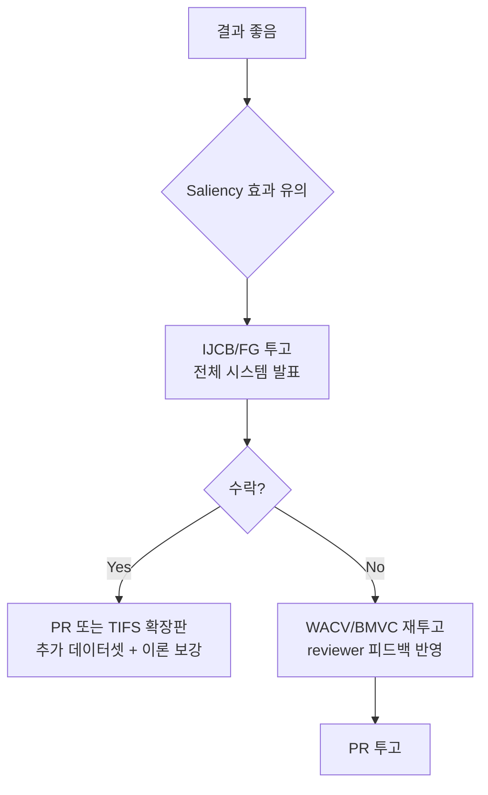
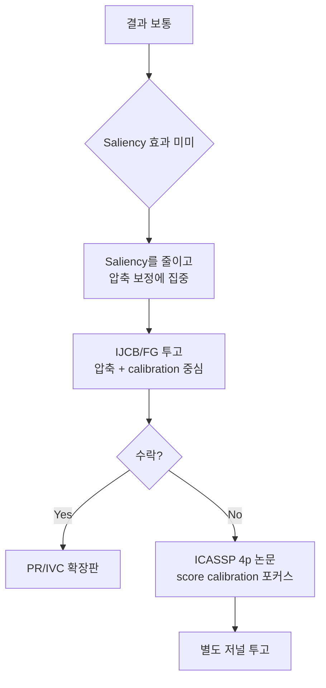
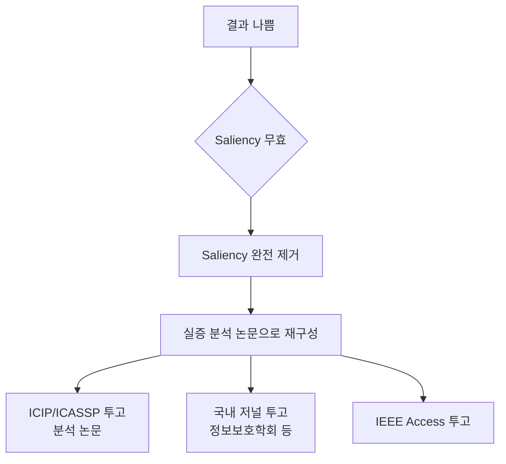

# 연구 방향별 저널·컨퍼런스 게재 가능성 분석

> **작성일**: 2026-07-15  
> **대상 연구**: 압축 ArcFace 임베딩 + Grad-CAM saliency 기반 선택적 fallback open-set 얼굴 검색  
> **하드웨어**: Intel i5-10600K, GTX 1080 Ti, 64GB RAM  
> **데이터셋**: LFW (개발/검증) + MegaFace/SurvFace/VGG2 부분집합 (open-set 평가)

---

## 1. 연구의 객관적 위치 평가

### 1.1 강점

| 항목 | 설명 |
|------|------|
| **교차 영역** | ANN 벡터 검색(DB 분야) + 얼굴인식(CV 분야) + 불확실성 보정(ML 분야)의 접점 |
| **실용성** | PostgreSQL/pgvector 실환경에서 end-to-end 검증 |
| **3단계 구조** | 압축 HNSW → 선택적 Grad-CAM → origin exact fallback은 구조적으로 명확 |
| **체계적 ablation** | 7단계 calibration baseline + 8가지 feature ablation + saliency 검증 |
| **재현성** | clean git commit, config hash, identity-disjoint split |

### 1.2 한계

| 항목 | 영향 | 심각도 |
|------|------|--------|
| **데이터셋 규모** | LFW 13K 벡터, gallery 50 identity — 이 규모에서 HNSW vs exact 차이가 미미 | ⚠️ 높음 |
| **MegaFace 부분집합** | 1M distractor 전체가 아닌 부분집합 → Top-tier 리뷰어에게 약점 | ⚠️ 높음 |
| **Grad-CAM 자체 novelty** | Grad-CAM은 2017년 방법, 얼굴인식 적용도 S-RISE 등 선행 존재 | ⚠️ 중간 |
| **ArcFace 동결** | 모델 자체를 개선하지 않음 → CV 최상위 venue에서는 contribution 약함 | ⚠️ 중간 |
| **GTX 1080 Ti** | 대규모 실험 불가, ablation 반복 제한 | ⚠️ 중간 |
| **석사논문 기반** | 연구 깊이와 폭에 자연적 한계 | ℹ️ 낮음 |

---

## 2. 결과 수준별 시나리오 정의

### 시나리오 A: 결과가 좋은 경우 ✅

다음 조건을 **모두** 만족:

```
1. Saliency 추가 시 동일 FPIR에서 fallback 비율이 유의하게 감소 (예: 15%+ 감소)
2. Grad-CAM의 영역 가림 검증(faithfulness)에서 Spearman ρ ≥ 0.5
3. PCA-384에서 certification coverage ≥ 95%, 정확도 100%
4. SurvFace/MegaFace 부분집합에서도 LFW와 유사한 경향 재현
5. Saliency 포함 전체 시스템이 origin exact보다 latency 절감
6. Bootstrap CI에서 saliency 유무 차이가 유의 (p < 0.05)
```

### 시나리오 B: 결과가 보통인 경우 🔶

```
1. Saliency 추가 효과가 있으나 미미 (fallback 5~15% 감소)
2. Grad-CAM faithfulness 부분적 (ρ ≈ 0.3~0.5)
3. PCA-384 certification 잘 작동, PCA-256 이하에서 급격히 열화
4. SurvFace에서 부분적으로 재현 (일부 조건에서만 개선)
5. 1차 압축 보정(saliency 없는)만으로도 상당한 효과
```

### 시나리오 C: 결과가 좋지 않은 경우 ❌

```
1. Saliency 추가 효과 없음 또는 역효과
2. Grad-CAM faithfulness 낮음 (ρ < 0.3)
3. 1차 압축 보정만으로 충분하여 saliency가 불필요
4. SurvFace에서 경향이 재현되지 않음
5. Grad-CAM 비용 > fallback 절감 이익
```

---

## 3. Venue 상세 분석

### Tier 1: 최상위 컨퍼런스 (수락률 20~25%)

| Venue | 분야 | IF/수락률 | 시나리오 A | 시나리오 B | 시나리오 C |
|-------|------|-----------|:---------:|:---------:|:---------:|
| **CVPR** | CV | ~25% | ❌ 불가 | ❌ 불가 | ❌ 불가 |
| **ICCV** | CV | ~25% | ❌ 불가 | ❌ 불가 | ❌ 불가 |
| **ECCV** | CV | ~28% | ❌ 불가 | ❌ 불가 | ❌ 불가 |
| **NeurIPS** | ML | ~25% | ❌ 불가 | ❌ 불가 | ❌ 불가 |
| **ICML** | ML | ~25% | ❌ 불가 | ❌ 불가 | ❌ 불가 |
| **VLDB/SIGMOD** | DB | ~20% | ❌ 불가 | ❌ 불가 | ❌ 불가 |

> [!CAUTION]
> **Tier 1 venue는 현실적으로 불가능합니다.** 이유:
> - CVPR/ICCV/ECCV: ArcFace를 동결하고 후처리만 하는 연구는 CV 핵심 기여로 보지 않음. Grad-CAM은 2017년 방법이며, 데이터셋 규모가 SOTA 비교에 불충분
> - NeurIPS/ICML: 이론적 기여(conformal guarantee 등)가 주요 novelty여야 하나, conformal prediction 자체는 기존 방법
> - VLDB/SIGMOD: MRQ(PVLDB 2026)가 이미 압축 벡터 검색의 bound + reranking을 다뤘고, 본 연구는 DB 시스템 자체의 기여가 아님

---

### Tier 2: 우수 저널 (IF 5~10, Q1)

| Venue | 분야 | IF (2025 기준) | 심사기간 | 시나리오 A | 시나리오 B | 시나리오 C |
|-------|------|--------------|---------|:---------:|:---------:|:---------:|
| **IEEE TIFS** | 보안/생체인식 | ~6.8 | 6~12개월 | 🟡 도전 가능 | ❌ 어려움 | ❌ 불가 |
| **IEEE TPAMI** | CV/ML | ~20.8 | 6~18개월 | ❌ 불가 | ❌ 불가 | ❌ 불가 |
| **PR (Pattern Recognition)** | 패턴인식 | ~7.5 | 3~9개월 | 🟡 도전 가능 | 🟡 가능 (major revision 예상) | ❌ 어려움 |
| **Image and Vision Computing** | CV | ~4.7 | 3~6개월 | ✅ 가능 | 🟡 도전 가능 | ❌ 어려움 |

#### IEEE TIFS (Transactions on Information Forensics and Security)

**시나리오 A에서 도전 가능한 이유:**
- TIFS는 생체인식 보안에 특화되어 있으며, "FPIR 보장 + 선택적 fallback + 저장 효율"은 보안 시스템 관점에서 실용적 가치가 있음
- 압축 오차로 인한 open-set 위험 분석은 forensic 응용에 직접 연결
- Saliency 기반 설명 가능성(explainability)은 보안 시스템 채택의 핵심 요소

**그러나:**
- TIFS 논문 수준은 매우 높으며, 통상적으로 대규모 데이터셋(IJB-B/C, FRVT급) 검증을 요구
- MegaFace/VGG2 **부분집합**으로는 reviewer를 설득하기 어려울 수 있음
- Saliency의 정량적 개선이 뚜렷해야 함

**필요한 추가 조건:**
- SurvFace 전체 또는 MegaFace distractor 최소 100K+ 사용
- Identity 단위 bootstrap CI에서 모든 핵심 주장의 유의성 검증
- 최소 2개 ArcFace backbone (예: R50, R100)에서 일반화 확인

> **참고 논문**: TIFS에 게재된 관련 연구 예시
> - Meng et al., "MagFace: A Universal Representation for Face Recognition and Quality Assessment," CVPR 2021 → 이후 TIFS 확장판
> - Boutros et al., "ElasticFace: Elastic Margin Loss for Deep Face Recognition," CVPR-W 2022 / IEEE TPAMI 2024
> - Kim et al., "AdaFace: Quality Adaptive Margin for Face Recognition," CVPR 2022

#### Pattern Recognition (Elsevier)

**시나리오 A~B에서 가장 현실적인 Q1 target:**
- PR은 "기존 방법의 새로운 조합 + 체계적 실험"을 잘 수용하는 편
- Open-set face identification + compression + calibration의 교차 연구는 PR 범위에 적합
- 데이터셋 규모 요구가 TIFS보다 상대적으로 유연
- **7.5 IF**로 연구 실적에 충분한 가치

**필요한 조건:**
- 최소 3개 데이터셋에서 결과 보고 (LFW + SurvFace + MegaFace 부분집합)
- 명확한 ablation table로 각 component의 기여도 분리
- 관련 연구 section에서 MRQ, KWS, DAM, S-RISE와의 차이를 명확히 정리

---

### Tier 3: 특화 컨퍼런스 (수락률 25~40%)

| Venue | 분야 | 수락률 | 시나리오 A | 시나리오 B | 시나리오 C |
|-------|------|--------|:---------:|:---------:|:---------:|
| **IJCB** (IEEE/IAPR) | 생체인식 | ~35% | ✅ 높음 | ✅ 가능 | 🟡 도전 가능 |
| **FG** (IEEE) | 얼굴/제스처 | ~40% | ✅ 높음 | ✅ 가능 | 🟡 도전 가능 |
| **BTAS** (IEEE) | 생체인식 | ~35% | ✅ 높음 | ✅ 가능 | 🟡 도전 가능 |
| **WACV** | CV (응용) | ~35% | ✅ 가능 | 🟡 도전 가능 | ❌ 어려움 |
| **BMVC** | CV (유럽) | ~30% | 🟡 도전 가능 | 🟡 도전 가능 | ❌ 어려움 |
| **ICASSP** | 신호처리 | ~45% | ✅ 가능 | ✅ 가능 | 🟡 도전 가능 |
| **ICIP** | 영상처리 | ~45% | ✅ 가능 | ✅ 가능 | ✅ 가능 |

#### IJCB (International Joint Conference on Biometrics) ⭐ 최우선 추천

**이유:**
- 생체인식 분야 **최고 특화 컨퍼런스** (IEEE + IAPR 공동 주관)
- Open-set face identification, threshold calibration, compression이 핵심 주제
- NIST FRVT 연구자들이 많이 참석하며, 연구의 실용적 가치를 높게 평가
- **데이터셋 규모에 대한 요구가 Top-tier CV보다 합리적**
- LFW + SurvFace 조합이면 충분히 수용 가능

**시나리오별 전략:**
- A: "압축 + saliency + selective fallback" 전체 구조를 발표
- B: saliency를 줄이고 "압축 오차 기반 calibration + fallback"에 집중
- C: saliency 제외, "PCA 차원별 open-set 성능 분석 + angular bound 유효 구간" 실증 연구로 재구성

> **참고**: IJCB 2027은 보통 2027년 1~3월 투고 마감. 현재 시점에서 준비 충분.

#### FG (IEEE Conference on Automatic Face and Gesture Recognition)

- IJCB와 유사하게 얼굴인식 특화
- 짝수 해에 개최 (FG 2028이 다음)
- 응용 연구와 분석 연구를 잘 수용
- 시나리오 B에서도 높은 가능성

#### WACV (Winter Conference on Applications of Computer Vision)

- CV 응용 분야에서 좋은 venue (IEEE)
- "시스템 설계 + 실험적 검증" 스타일 논문에 적합
- 시나리오 A에서 가능하나, pure CV novelty를 기대하는 reviewer 배정 시 어려울 수 있음

#### ICASSP (IEEE International Conference on Acoustics, Speech and Signal Processing)

- 4페이지 short paper 형식
- KWS 양자화 calibration 논문이 ICASSP 2026에 게재됨 → 직접 선행 연구와 같은 venue
- 시나리오 B에서도 "얼굴 임베딩 압축의 score calibration"으로 충분히 게재 가능
- **빠른 심사 주기** (투고→결과 3~4개월)

---

### Tier 4: Q2 저널 및 접근성 높은 저널

| Venue | IF | 시나리오 A | 시나리오 B | 시나리오 C |
|-------|-----|:---------:|:---------:|:---------:|
| **IEEE Access** | ~3.4 | ✅ 확실 | ✅ 확실 | ✅ 가능 |
| **MDPI Sensors / Applied Sciences** | ~3.4 / ~2.5 | ✅ 확실 | ✅ 확실 | ✅ 가능 |
| **Expert Systems with Applications** | ~7.5 | ✅ 가능 | 🟡 도전 가능 | ❌ 어려움 |
| **Neurocomputing** | ~5.5 | ✅ 가능 | 🟡 도전 가능 | ❌ 어려움 |
| **J. King Saud Univ. - Computer and Information Sciences** | ~6.9 | ✅ 가능 | ✅ 가능 | 🟡 도전 가능 |

> [!WARNING]
> **IEEE Access**와 **MDPI 계열**은 게재가 비교적 용이하나, 연구 업적으로서의 평가가 다른 venue에 비해 낮습니다. AGENTS.md 규칙에 따라 "IEEE Access는 필요에 따라 참고하고, MDPI 등 평가가 엇갈리는 출판사는 우선순위를 낮춘다"는 원칙을 고려해야 합니다.

---

### Tier 5: 국내 저널 및 학회

| Venue | 등급 | 시나리오 A | 시나리오 B | 시나리오 C |
|-------|------|:---------:|:---------:|:---------:|
| **정보보호학회논문지** | KCI 우수등재 | ✅ 확실 | ✅ 확실 | ✅ 확실 |
| **전자공학회논문지** | KCI 등재 | ✅ 확실 | ✅ 확실 | ✅ 확실 |
| **정보처리학회논문지** | KCI 등재 | ✅ 확실 | ✅ 확실 | ✅ 확실 |
| **한국멀티미디어학회논문지** | KCI 등재 | ✅ 확실 | ✅ 확실 | ✅ 확실 |
| **KCC/KIPS 학술대회** | 국내 학회 | ✅ 확실 | ✅ 확실 | ✅ 확실 |

> 석사논문 졸업 요건 충족에 가장 안전한 선택지. 연구 내용의 일부만으로도 충분히 게재 가능.

---

## 4. 데이터셋 전략의 영향

### 4.1 현재 데이터셋 계획 평가

| 데이터셋 | 역할 | Gallery 규모 | 강점 | 약점 |
|---------|------|------------|------|------|
| **LFW** | 개발/검증 | 50 identity | 표준 벤치마크, 빠른 반복 | 너무 작고 "해결된" 벤치마크로 간주 |
| **SurvFace** | Open-set 평가 | 3,000 identity | 실제 surveillance 품질, open-set 프로토콜 내장 | 해상도 매우 낮아 ArcFace 정확도 자체가 낮을 수 있음 |
| **MegaFace 부분집합** | Distractor 추가 | 부분집합 사용 | 대규모 distractor 효과 부분 검증 | "부분집합"이 정확히 얼마인지에 따라 설득력 변동 |
| **VGG2 부분집합** | 추가 평가 | 부분집합 사용 | 다양한 자세/조명 | 동일 약점 |

### 4.2 Venue별 데이터셋 수용 가능성

| 데이터셋 구성 | TIFS | PR | IJCB | FG | ICASSP | IEEE Access |
|-------------|:----:|:--:|:----:|:--:|:------:|:-----------:|
| LFW만 | ❌ | ❌ | ❌ | 🟡 | 🟡 | ✅ |
| LFW + SurvFace | 🟡 | 🟡 | ✅ | ✅ | ✅ | ✅ |
| LFW + SurvFace + MegaFace 부분집합(100K+) | ✅ | ✅ | ✅ | ✅ | ✅ | ✅ |
| LFW + SurvFace + MegaFace 전체(1M) | ✅ | ✅ | ✅ | ✅ | ✅ | ✅ |

> [!IMPORTANT]
> **핵심 권고**: MegaFace distractor를 최소 100K~200K 정도는 사용해야 Tier 2~3 venue에서 "대규모 gallery에서도 유효"라는 주장이 설득력을 가짐. GTX 1080 Ti + 64GB RAM으로 pgvector에 100K~200K 벡터 저장 및 HNSW 검색은 충분히 가능한 규모.

### 4.3 추천 데이터셋 구성

```
최소 구성 (Tier 3~4 target):
  - LFW: 개발 + ablation
  - SurvFace: open-set 최종 평가

권장 구성 (Tier 2~3 target):
  - LFW: 개발 + ablation + 디버깅
  - SurvFace: surveillance 품질 평가
  - MegaFace distractor 100K~200K: 대규모 gallery 효과
  - VGG2 부분집합 (identity 500~1000개): cross-dataset 일반화

이상적 구성 (Tier 2 target):
  위 모든 것 + IJB-B/C 또는 MegaFace 전체
  (하드웨어 한계로 어려울 수 있음)
```

---

## 5. 시나리오별 최적 전략

### 시나리오 A: 결과가 좋은 경우 ✅



**투고 순서 추천:**
1. **IJCB 2027** (컨퍼런스, 빠른 피드백) — 전체 시스템
2. 수락 시 → **Pattern Recognition** 확장판 (저널, 추가 실험)
3. 거절 시 → reviewer 피드백 반영 후 **WACV 2028** 또는 **FG 2028**

**논문 구성:**
- 제목: "Selective Saliency-Guided Score Calibration for Compressed Face Embedding Search in Open-Set Identification"
- 핵심 기여 4개 모두 제시
- Grad-CAM faithfulness 검증을 Section으로 포함
- SurvFace + MegaFace 부분집합 결과가 핵심 table

---

### 시나리오 B: 결과가 보통인 경우 🔶



**전략 조정:**
- Saliency를 "optional 2단계"가 아닌 "ablation의 한 축"으로 격하
- 핵심 기여를 "1차 저비용 calibration + angular bound 유효 구간 발견"으로 재설정
- 제목 변경: "Compression-Aware Score Calibration for Open-Set Face Search with Selective Exact Fallback"

**투고 순서 추천:**
1. **IJCB 2027** — 압축 보정 + fallback 시스템 중심
2. 동시에 **ICASSP 2027** 또는 **ICIP 2027** — 4p short paper로 score calibration 결과만 발표
3. 저널로 **Pattern Recognition** 또는 **Image and Vision Computing**

---

### 시나리오 C: 결과가 좋지 않은 경우 ❌



**논문 재구성:**
- "Saliency 기반 보정"을 주장하지 않음
- "PCA 차원별 open-set face identification 성능 변화의 체계적 분석"으로 방향 전환
- Negative result도 가치가 있음: "Grad-CAM saliency는 압축 score 불확실성을 추가로 설명하지 못한다"

**가능한 제목:**
- "Empirical Analysis of PCA Compression Effects on Open-Set Face Identification in PostgreSQL/pgvector"
- "How Much Can You Compress? A Systematic Study of PCA Dimension Selection for Face Search with FPIR Guarantees"

**투고 순서 추천:**
1. **ICIP 2027** — 분석/실증 논문 (4p)
2. **정보보호학회논문지** 또는 **전자공학회논문지** — 한글 논문으로 석사 요건 충족
3. 선택적으로 **IEEE Access** — 영문 실적 확보

---

## 6. Venue 특성 상세 비교표

| Venue | 유형 | IF/등급 | 수락률 | 심사기간 | 페이지 | OA 비용 | 적합도 |
|-------|------|--------|--------|---------|--------|---------|--------|
| **IJCB** | 컨퍼런스 | IEEE | ~35% | 3~4개월 | 8p | 포함 | ⭐⭐⭐⭐⭐ |
| **FG** | 컨퍼런스 | IEEE | ~40% | 3~4개월 | 8p | 포함 | ⭐⭐⭐⭐⭐ |
| **ICASSP** | 컨퍼런스 | IEEE | ~45% | 3~4개월 | 4p | 포함 | ⭐⭐⭐⭐ |
| **ICIP** | 컨퍼런스 | IEEE | ~45% | 3~4개월 | 4p | 포함 | ⭐⭐⭐⭐ |
| **WACV** | 컨퍼런스 | IEEE | ~35% | 3~4개월 | 8p | 포함 | ⭐⭐⭐ |
| **PR** | 저널 | ~7.5 Q1 | 20~30% | 3~9개월 | 자유 | ~$3,500 | ⭐⭐⭐⭐ |
| **IVC** | 저널 | ~4.7 Q1 | 25~35% | 3~6개월 | 자유 | ~$3,000 | ⭐⭐⭐⭐ |
| **TIFS** | 저널 | ~6.8 Q1 | 15~25% | 6~12개월 | 자유 | - | ⭐⭐⭐ |
| **IEEE Access** | 저널 | ~3.4 Q2 | ~40% | 1~3개월 | 자유 | ~$1,750 | ⭐⭐ |
| **정보보호학회** | 저널 | KCI 우수 | ~50% | 2~4개월 | 자유 | 저렴 | ⭐⭐⭐ |

---

## 7. 핵심 권고사항

### 7.1 가장 현실적인 목표: IJCB + PR 조합

> [!TIP]
> **추천 전략**: IJCB에서 컨퍼런스 발표 → Pattern Recognition에 확장 저널 투고
> 
> 이 조합은 다음 이유로 최적입니다:
> 1. IJCB는 연구 주제에 가장 정확히 맞는 venue
> 2. 빠른 피드백으로 논문 품질 개선 가능
> 3. PR은 컨퍼런스 확장판을 명시적으로 수용 (30%+ 새 내용 추가 필요)
> 4. 두 venue 모두 데이터셋 규모에 대한 요구가 합리적

### 7.2 Saliency 전략

| 조건 | 권고 |
|------|------|
| Saliency 효과가 유의한 경우 | 핵심 기여의 일부로 포함. 제목에 반영 |
| Saliency 효과가 미미한 경우 | Ablation의 한 축으로 격하. "Negative finding"으로 정직하게 보고 |
| Saliency 효과가 없는 경우 | 완전히 제거하고 1차 calibration에 집중. 논문 범위를 축소 |

> [!IMPORTANT]
> **Saliency(Grad-CAM)에 연구의 성패를 걸지 마세요.** 1차 저비용 calibration(score + margin + angular error)만으로도 충분한 기여가 됩니다. Saliency는 "있으면 좋은" 추가 기여이지, 없으면 논문이 불가능한 필수 요소가 아닙니다.

### 7.3 데이터셋 우선순위

```
즉시 실행:
  1. LFW 기존 파이프라인에서 PCA sweep 완료 ✅ (이미 완료)
  2. SurvFace 파이프라인 구축 및 baseline 실행

MegaFace 부분집합 구성:
  3. MegaFace distractor에서 100K~200K 랜덤 샘플링
  4. 이를 pgvector gallery에 추가하여 대규모 검색 실험
  5. (선택) VGG2에서 500~1000 identity 추가 평가

이 순서로 데이터셋 규모를 점진적으로 확대하면
GTX 1080 Ti 환경에서도 충분히 수행 가능합니다.
```

### 7.4 시간표 제안 (석사 졸업 기준)

| 기간 | 작업 | 목표 |
|------|------|------|
| 2026년 7~8월 | SurvFace 파이프라인 + MegaFace 부분집합 구성 | 데이터셋 확보 |
| 2026년 8~9월 | 1차 calibration 실험 완료 | Core 결과 확보 |
| 2026년 9~10월 | Grad-CAM 파이프라인 + saliency 실험 | Saliency 유효성 판단 |
| 2026년 10~11월 | 시나리오 판단 → 논문 작성 시작 | 초고 완성 |
| 2026년 11~12월 | IJCB 2027 투고 (마감 확인 필요) | 컨퍼런스 투고 |
| 2027년 1~3월 | 석사논문 작성 + 국내 저널 투고 | 졸업 요건 |
| 2027년 3~6월 | PR/IVC 저널 확장판 투고 | 저널 실적 |

---

## 8. 요약 매트릭스

| 시나리오 | 최선 목표 | 현실적 목표 | 안전망 |
|---------|----------|-----------|--------|
| **A (좋음)** | IJCB → PR (Q1, IF 7.5) | WACV / FG | ICASSP + 국내 저널 |
| **B (보통)** | IJCB → IVC (Q1, IF 4.7) | ICASSP + 국내 저널 | IEEE Access |
| **C (나쁨)** | ICIP (분석 논문) | 국내 저널 | IEEE Access |

> [!NOTE]
> **어떤 시나리오에서든 석사 졸업은 충분히 가능합니다.** 시나리오 C에서도 "PCA 압축이 open-set face identification에 미치는 체계적 영향 분석"은 국내 저널에 충분한 기여이며, 현재 이미 확보된 20260715-R001 실험 결과만으로도 유의미한 발견(certification 유효 구간, knee point 등)이 있습니다.

---

## 9. 관련 참고 논문 (venue 선택 근거)

| 논문 | Venue | 관련성 |
|------|-------|--------|
| Grother et al., "Face Recognition Vendor Test (FRVT)" | NIST Report | Open-set 프로토콜 표준 |
| Deng et al., "ArcFace" | CVPR 2019 | 기반 모델 |
| Jégou et al., "Product Quantization" | IEEE TPAMI 2011 | PQ 기반 방법 |
| Yang et al., "MRQ: Multi-Resolution Quantized Search" | PVLDB 2026 (동료심사 완료) | 직접 경쟁 — DB 검색 측 |
| KWS quantization calibration | ICASSP 2026 (동료심사 완료) | 직접 경쟁 — score calibration 측 |
| Selvaraju et al., "Grad-CAM" | ICCV 2017 | Saliency 기반 방법 |
| Knoche et al., "S-RISE" | arXiv (동료심사 미확인) | Face pair similarity 설명 |
| Meng et al., "MagFace" | CVPR 2021 | 품질 + 얼굴인식 |
| Vovk et al., "Conformal Prediction" | Springer 2005 | 불확실성 보정 이론 |
| Malkov & Yashunin, "HNSW" | IEEE TPAMI 2020 (동료심사 완료) | ANN 검색 인덱스 |

---

> **최종 결론**: 연구 방향은 타당하며, **IJCB를 primary target으로 설정하고 결과에 따라 PR 또는 IVC로 확장**하는 것이 가장 현실적인 전략입니다. Saliency는 핵심 무기가 아닌 추가 무기로 위치시키세요. 어떤 결과가 나오든 국내 저널 + 석사 졸업은 안전합니다.
